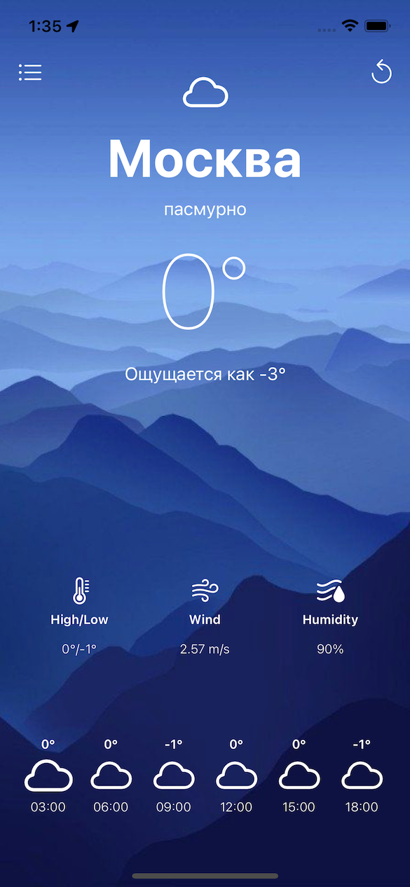

# WeatherApp
ios application for getting weather. 

The app is getting data from the API: [OpenWeather](https://openweathermap.org/api)

### App description

The app contains two screens:
1. main screen - shows the weather data of the city
2. city selection screen - shows a table of cities and, with permission to receive a geolocation, current location. Has a field for entering the name of the city.

Screenshot of the main screen of the application with the output:
- city / current location
- temperature, description of the current weather
- data on low and high temperature, humidity and wind
- weather for the future with an interval of 3 hours (API)

Screenshot of the city selection screen displays:
- cell location (if allowed by user)
- city table
- a field for entering the name of the city with a button for getting the weather

### Received knowledge

- API, network
- architectural pattern MVC
- TableView
- UINavigationController 
- CoreLocation
- UserDefaults
